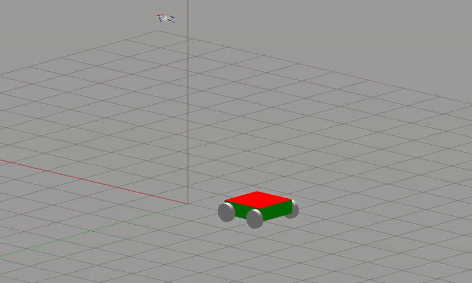

# DQL_quadrotor_landing

Implementation of Double Q-Learning with Curriculum Learning for Autonomous UAV Landing on a Moving Platform.


## Prerequisites

1. **Operating System:** Ubuntu 20.04
2. **ROS Version:** ROS Noetic Full Desktop

## Installation Guide

### Step 1: Install ROS Noetic Full Desktop

Follow the official installation guide for ROS Noetic:  
[ROS Noetic Installation](http://wiki.ros.org/noetic/Installation/Ubuntu)

### Step 2: Clone the Repository

```bash
git clone https://github.com/valerio98-lab/DQL_multirotor_landing.git
```
```bash
cd DQL_multirotor_landing
```

### Step 3: Install Dependencies and Build
```bash
pip install -r requirements.txt
```

```bash
catkin_make
```

```bash
source devel/setup.bash
```

### Step 4: Training an Agent
```bash
chmod +x training.sh
```

```bash
./training.sh
```

### Step 5: Testing an Agent
```bash
chmod +x test.sh
```

```bash
./test.sh
```

### Repository Overview

|  | 

This repository implements a modular system for autonomous quadrotor landing on a moving platform using Reinforcement Learning. The architecture is built on ROS and Gazebo, and leverages tabular Double Q-Learning with curriculum learning. The codebase is structured into several key components, grouped by their functional role:

---

#### 1. ROS Node Architecture

- **`manager_node.py`**  
  Central node orchestrating the entire simulation. It handles communication with Gazebo, computes relative observations between the drone and the moving platform, publishes transform frames, and interfaces with PID and attitude controllers.

- **`pid_node.py`**  
  Standalone PID controller node for yaw and vertical thrust. It receives setpoints and publishes control efforts accordingly.

- **`attitude_node.py`**  
  Attitude controller node responsible for roll, pitch, yaw rate, and thrust. It translates high-level control commands into individual rotor velocities using a geometric controller on SO(3).

---

#### 2. Control Modules

- **`attitude_controller.py`**  
  Implements a geometric attitude controller based on Lee et al.'s method. It calculates required control moments and maps them to motor velocities using an allocation matrix specific to the quadrotor configuration.

- **`pid.py`**  
  Full implementation of a discrete PID controller with Butterworth filtering. Used to regulate yaw and vertical velocity (thrust) in real-time during simulation.

---

#### 3. Reinforcement Learning Logic

- **`training.py`**  
  Entry-point script that starts a training session. It launches the training node and invokes the curriculum learning routine via the `Trainer` class.

- **`simulation.py`**  
  Script to run a trained agent in simulation mode. It loads pretrained policies and evaluates their performance on the landing task.

- **`trainer.py`**  
  Controls the entire training lifecycle. It manages curriculum progression, exploration scheduling, learning rate adaptation, reward logging, and Q-table updates.

- **`double_q_learning.py`**  
  Defines the Double Q-Learning agent logic. Maintains two Q-tables and a state-action counter, handles action selection, updates, and transfer learning across curriculum steps.

- **`mdp.py`**  
  Encapsulates the Markov Decision Process logic. Includes both training and simulation environments, state discretization, reward shaping, curriculum scaling, and terminal condition evaluation.

---

Each of these components interacts through ROS topics and services to form a cohesive control loop—from simulation to decision-making and actuation. The architecture is optimized for modularity, low compute requirements, and sample-efficient learning.


---

## 📚 References

This project is inspired by the methodology proposed in:

> P. Goldschmid, A. Ahmad (2024).  
> **Reinforcement Learning Based Autonomous Multi-Rotor Landing on Moving Platforms**.  
> *Autonomous Robots*, Springer. https://doi.org/10.1007/s10514-024-10162-8


