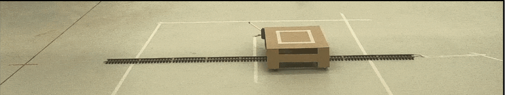

# Moving Platform Control
 

## General
This repository contains the code and some instructions about how a platform moving on rails can be controlled using ROS. To this end, a ROS interface via [LibrePilot](https://github.com/robot-perception-group/LibrePilot/tree/be0a2d692110ab10cb0be75e5a6598a152cf01e0) is applied that leverages a [LibrePilot Revolution Flight Controller](https://librepilot.atlassian.net/wiki/spaces/LPDOC/pages/26968084/OpenPilot+Revolution) board for the generation of PWM signals that can be processed by an ESC to control a model train. Attached to the model train is a wooden structure with wheels - the moving platform. Since the details of the ESC and power supply are individual to each project, only the basic parts of the code and how to use it will be explained in the following.

This package was used as part of [this project](https://github.com/robot-perception-group/rl_multi_rotor_landing) dealing with autonomous multi-rotor landing on moving platforms.

If you have any comments or questions, please contact: Pascal Goldschmid, pascal.goldschmid@ifr.uni-stuttgart.de

## Downloading Code
Download the code by running 
```
git clone --recurse-submodules https://github.com/robot-perception-group/moving_platform_control
```

## Preparing LibrePilot
The LibrePilot GCS software is used to configure the flight controller board. For the installation of LibrePilot on Ubuntu 20 follow the  installation instructions described [here](other_files/librepilot_installation.txt). Open the LibrePilot GCS and connect your LibrePilot Revolution board via USB with your computer. Wait until the connection has been established before you click on `Files --> Import UAV Settings` and select [this](other_files/settings_moving_platform.uav) file.
In the configuration pane in of the LibrePilot GCS configure the settings as needed for your remote control.

## Building ROS Nodes
In order to build the ROS nodes, `cd` into the root directory of the downloaded github repository and run 
```
catkin_make
```
followed by 
```
source devel/setup.bash
```

## Launching ROS Nodes
### General
There are three nodes that need to be launched in order to make the platform perform a rectilinear periodic movement on straight rails.
The [interface node](src/moving_platform_control/scripts/ros_pid_fc_interface.py) is required to extract required information from ros topics providing positional information of the platform via a position determination system (e.g. a motion capture system) and the PID controller node. It redistributes the information on other topics and has simple safety features that make the platform stop once certain positional limit values are exceeded. The PWM values are computed here and published to the ROS network to be processes by the ROSBridge node (see below) later. The [setpoint node](src/moving_platform_control/scripts/mp_setpoints.py) is used to publish positional setpoints the platform should track via the PID controller. The ROSBridge node uses the data provided the other nodes and sends them via the ROSBridge of the LibrePilot package to the flight controller board which will then output the PWM values required by the ESC for controlling the train. 

### Interface Node
The interface node can be launched by running in a terminal window (source the workspace first with the above `source` command)
```
roslaunch moving_platform_control ros_pid_fc_interface.launch PARAM_1:=VALUE_1 PARAM_2:=VALUE_2 ...
```
The following parameters are available.
| Parameter     | Description   |   Default Value|      
| ------------- |:-------------:|--------------
| publish_hz    | Frequency with which PWM values are computed and sent to the FC. | 100hz |
| x_offset    | Offset value that is used to correct the received position of the platform in x-direction. | 0m |
| y_offset    | Offset value that is used to correct the received position of the platform in y-direction. | 0m |
| z_offset    | Offset value that is used to correct the received position of the platform in z-direction. | 0m |
| pwm_neutral |PWM value which stops the moving platform.| 1500| 
| max_amplitude |Maximum distance from the origin the platform may reach. If exceeded, the neutral PWM value will be sent to stop the platform.| 1m| 

*Note*: Currently the safety feature regarding the maximum amplitude of platform movement is only implemented for a movement in y-direction but can be easily adapted.

The PWM signal for the ESC will be output by the LibrePilot Revolution flight controller on channel 0.

### Setpoint Node
The setpoint node can be launched by running in a terminal window (source the workspace first with the above `source` command)
```
roslaunch moving_platform_control mp_setpoints.launch PARAM_1:=VALUE_1 PARAM_2:=VALUE_2 ...
```
The following parameters are available
| Parameter     | Description   |   Default Value|      
| ------------- |:-------------:|--------------
| update_freq    | Frequency with which setpoint values for a rectilinear periodic movement are published. | 10hz |
| vmax    | Maximum velocity of the rectilinear periodic movement. | 0.4m/s |
| rmax    | Maximum radius of the rectilinear periodic movement. | 0.5m |
| x_offset    | Offset value defining the center of the rectilinear periodic movement. | 0m |


### ROSBridge Node
The ROSBridge node should be the last node that is started. If the other two nodes are set up properly this should be the case automatically.
The ROS bridge node can be launched by running in a terminal window (source the workspace first with the above `source` command)
```
rosrun librepilot librepilot_node moving_platform /dev/ttyACM0 115200 _name:=moving_platform
```
## 
## 
## 

*Disclaimer:* Use at own risk. The author, contributors and associated affiliations cannot be held responsible for any damage to hardware or persons. 
